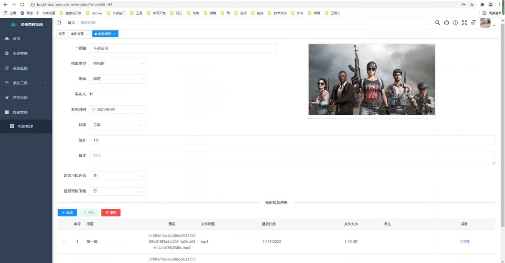
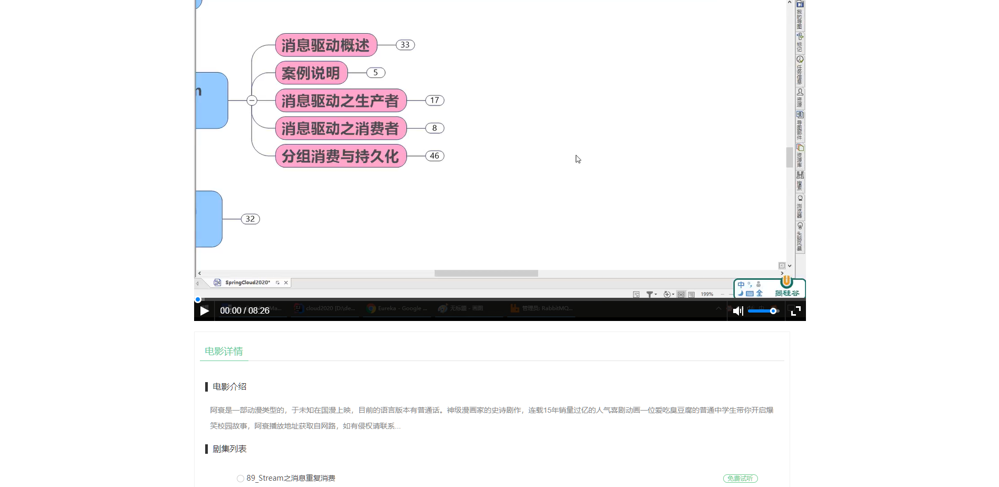

## 视频平台简介

借助**ruoyi**这个平台开发一套**视频播放网站**。直接采用了[RuoYi-Vue](https://gitee.com/y_project/RuoYi-Vue)前后端分离基础平台。在原基础上加媒资管理

目前做的了简单的保存上传视频功能。目前这个系统分有 门户和后台管理，各一个有前端和后端项目。

## 技术要点

- 前端采用Vue、Element UI、nuxt
- 后端采用Spring Boot、Spring Security、Redis & Jwt。
- 权限认证使用Jwt，支持多终端认证系统。
- 支持加载动态权限菜单，多方式轻松权限控制。
- 高效率开发，使用代码生成器可以一键生成前后端代码。
- ckplay视频播放插件

## 项目截图

<table>
    <tr>
        <td></td>
        <td></td>
    </tr>
</table>    

##### 已完成

目前已经完成简单页面实现了视频上传功能

##### 待办事项

##### 优化

1.后续上传功能  增加多功能上传。可以进行本地上传。也可以进行七牛云或者阿里云上传。通过策略的方式不同来进行上传。可能还会优化成流媒体的方式，保存流媒体文件。采用ffmeg工具进行转换文件。通过这个插件还要写一些工具类来转换以及获取视频播放时间等等。
2.优化界面。 这几个功能都需要进行组件化。
3.加一个sql版本控制。这样sql在任何数据库都不会出现问题。
4.登录优化。 增加是否可以多地登录  增加登录顶号功能。采用websocket来进行监控。
5.门户后端将如何设计得和别人多聊聊。看看有没有更可靠的方案
