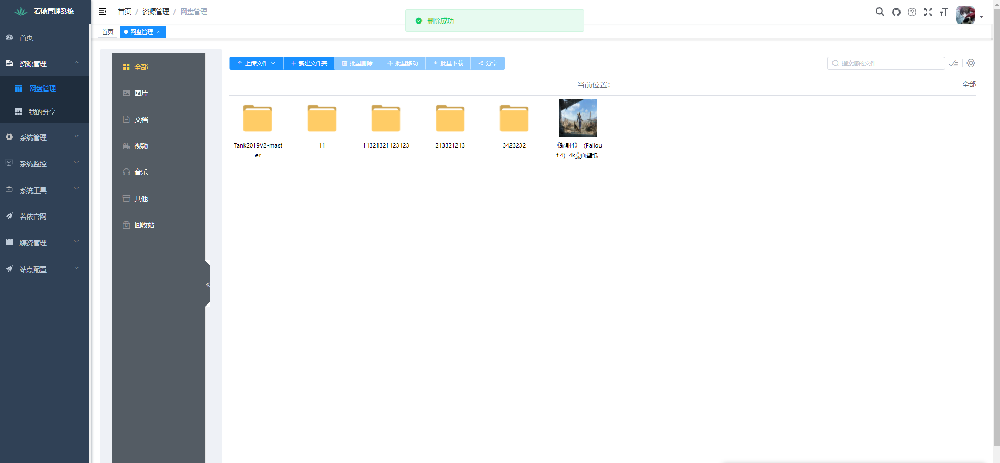
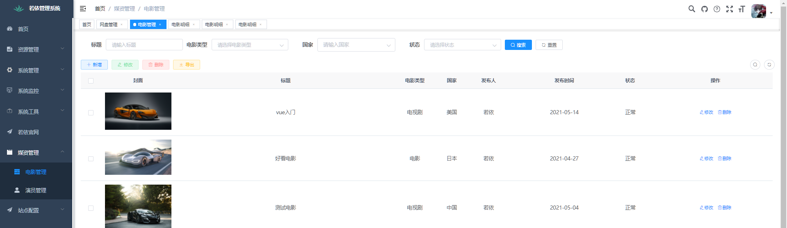
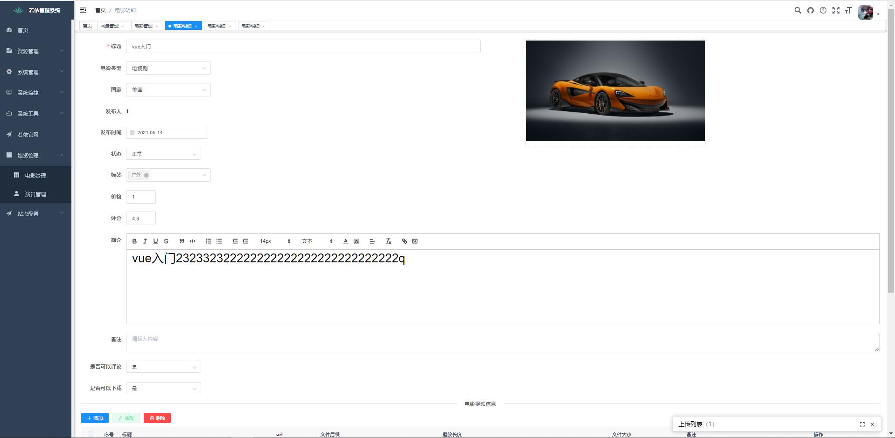
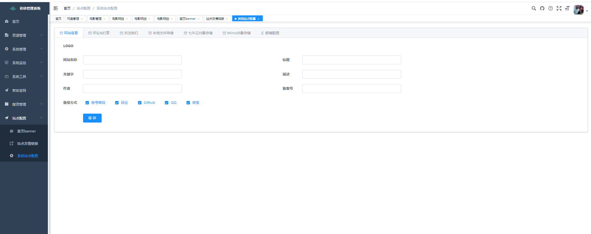
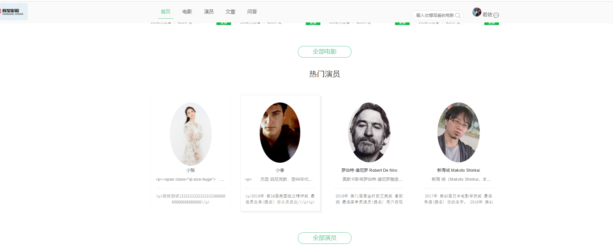
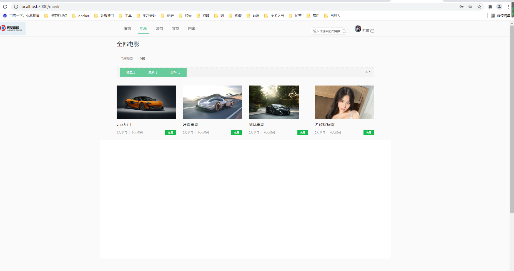
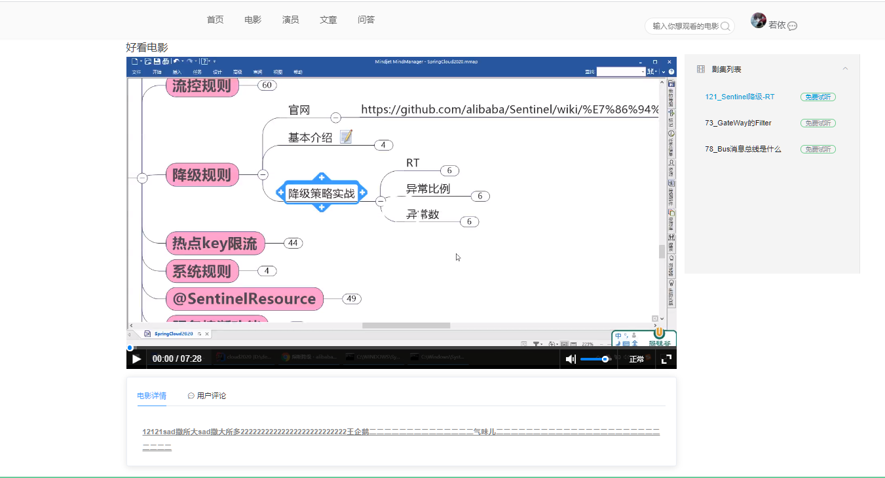

## 电影平台简介

借助**ruoyi**这个平台开发一套资源平台。直接采用了[RuoYi-Vue](https://gitee.com/y_project/RuoYi-Vue)前后端分离基础平台。打造一款开源的电影视频平台。集成了奇文网盘。后台用的是vue+springboot，门户采用nuxtjs+springboot。

## 技术要点

- 前端采用Vue、Element UI、nuxt
- 基础平台采用的是[RuoYi-Vue](https://gitee.com/y_project/RuoYi-Vue)
- 后端采用Spring Boot、Spring Security、Redis & Jwt。
- 权限认证使用Jwt，支持多终端认证系统。
- 支持加载动态权限菜单，多方式轻松权限控制。
- 高效率开发，使用代码生成器可以一键生成前后端代码。
- 视频播放 采用ckplay插件 
- [vue-simple-uploader](https://github.com/simple-uploader/vue-uploader/blob/master/README_zh-CN.md)：一款基于 [simple-uploader.js](https://github.com/simple-uploader/Uploader/blob/develop/README_zh-CN.md) 开发的适用于 Vue.js 的分片上传插件
- [vue-video-player](https://github.com/surmon-china/vue-video-player)：一款基于 [video.js](https://docs.videojs.com/) 开发的视频播放组件
- 集成了奇文网盘[qiwen-file](https://gitee.com/qiwen-cloud/qiwen-file)

## 项目截图

##  联系我们

如您有问题，请加入 QQ 群咨询

群号864499414

