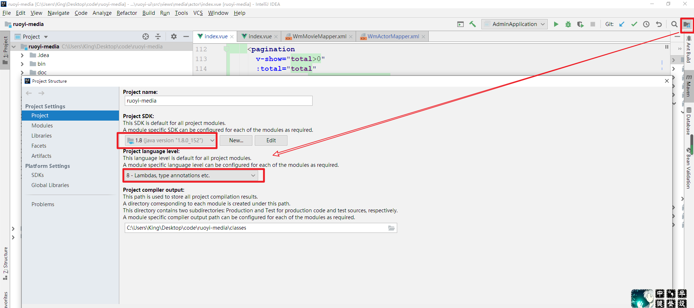
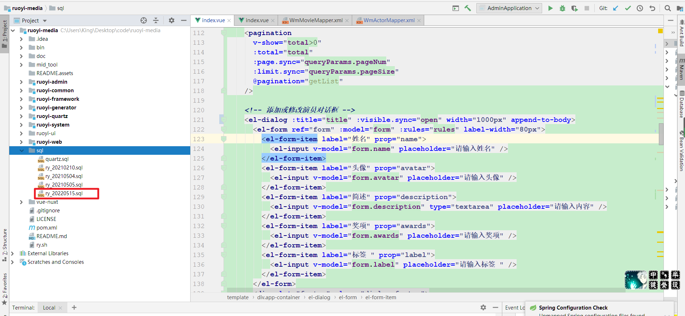
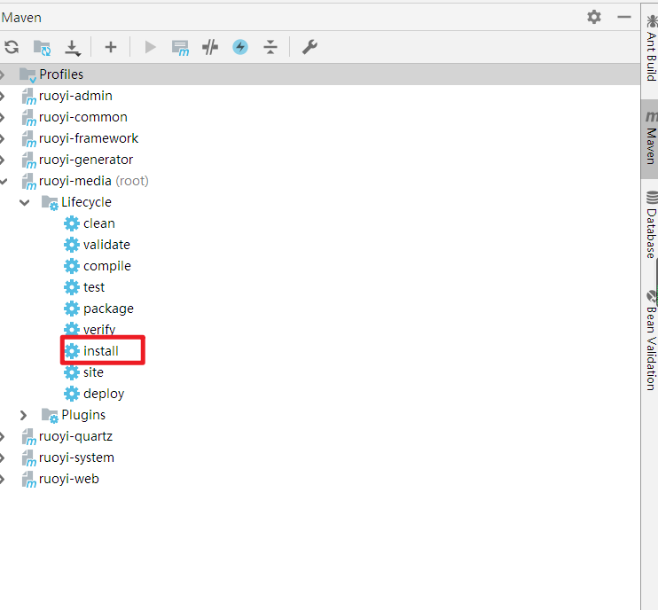
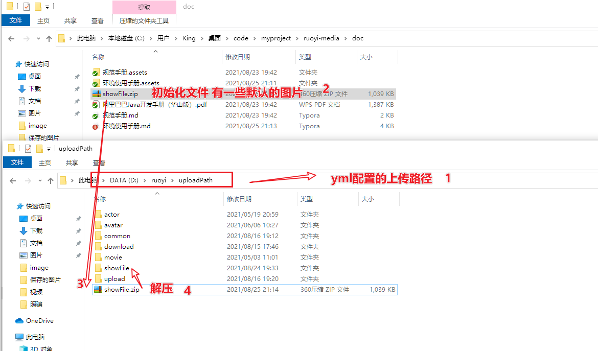
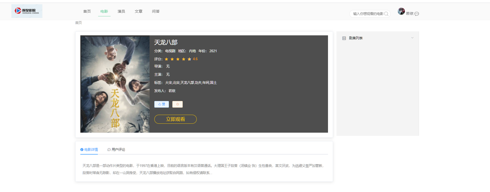

# **1.** **准备工作**

**1.1** **前置环境准备**——**安装Maven**

项目基于Maven管理项目的构建，需要先安装好相应的版本。采用jdk8

**1.2** **开发工具**

开发工具可以采用eclipse 和 idea都可以 


# **2.** **开发环境搭建**

### **2.1** **开发工具的配置**

##### **2.1.1** 配置Maven


##### 2.1.2 配置jdk




##### 2.1.3安装lombok插件


idea直接找到

##### 2.1.4导入sql

找到**最新**的sql直接导入




# **3.** 运行系统

##### **3.1.1 **开发环境配置

编辑src/main/ resources目录下的application.yml 文件，

默认端口为80

 

##### 3.1.2 代码生成配置

编辑ruoyi-generator模块 下 src/main/ resources目录下的generator.yml 文件，


默认为module，根据实际情况修改即可。生成的表要有注释

注：如对模板有特殊需求，可自行修改。编辑src/main/ resources/templates/vm目录下


##### **3.1.3 日志配置**

编辑ruoyi-admin或者ruoyi-wen 下的src/main/ resources目录下的logback.xml 文件

```xml
 <!-- 日志存放路径 -->
<property name="log.path" value="/home/ruoyi/logs" />
```

改为自己需要的路径


##### 3.1.4启动redis和nginx

**注意**：必须启动的中间件

在midleware包下redis和nginx 直接启动即可


##### 3.1.5启动后端

后端分有门户后端和后台后端，分别来ruoyi-web和ruoyi-admin，配置好数据库连接后 都可以直接启动main方法运行。记得启动前先来个全局打包




##### 3.1.6启动前端

前端同样分为门户前端和后台前端。分别为vue-nuxt和ruoyi-ui


每个前端的顺序都是在cmd目录下 先打包 然后运行

```shell
#打包
npm install --registry=https://registry.npm.taobao.org
#运行
npm run dev
```


##### 3.1.7导入相关初始化文件

项目准备了一些演示图片 我们只要把相关的压塑包解压到配置好的文件路径即可



# 4.部署系统

##### 4.1后端部署

Jar方式部署

执行命令：java –jar ruoyi-admin.jar 

脚本执行：ry.sh start 启动stop 停止


##### **4.2前端部署**

```shell
#打包正式环境
npm run build:prod

 # 打包预发布环境

npm run build:stage

```


# 


# 5.项目截图


