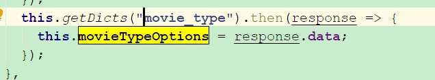

# 规范手册

具体可以参考  阿里巴巴Java开发手册（华山版）.pdf

我这边例句一些本项目的规范。

# 1.数据库建表

#### 1.1表名规范

一般会按照功能范畴前缀 加功能名称

例如：wm_movie 就是代表媒资范畴的 movie电影表

wm_video代表媒资范畴的 movie视频表

sys_dict_data 代表 系统范畴的 字典数据表

#### 1.2默认字段

默认表 都有创建人、创建时间、更新人、更新时间、删除标志、备注 分别为以下字段
create_by  create_time  update_by  update_time   del_flag  remark

少数表除外

# 2.实体类

#### 2.1实体类命名

分有vo和原实体do 我这边do命名和数据库+大驼峰来命名

**注意** 这里是需要去掉数据库名称功能范畴前缀的

例子： wm_media  BO-> MediaVideo   VO ->MediaVideoVO

注意 我们的BO实体要跟数据库字段保持一致 不可以添加其他字段 用vo来建立关系

# 3.字典

#### 3.1字典类型添加事项

字典类分别有sys_dict_type  和  sys_dict_data

注意 我们的type  也就是查询类型的时候 命名需要统一  比如 我们有一个movie的表 字段 type类型 

那么我们的数据字典类型就是movie_type  也就是去掉前缀后 + 这个字段名称

# 4.git

#### 4.1提交命名规范

【A】1.描述 2.描述

A一般可以为  bug   fix   add   优化  规范   初始化  重构 .......

统一按照这个规范去执行。这样我们就知道我们具体是做的是什么了！  

