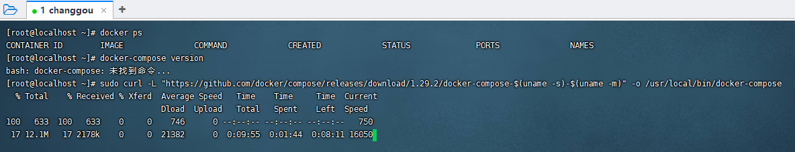
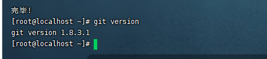
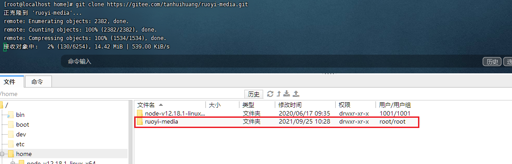
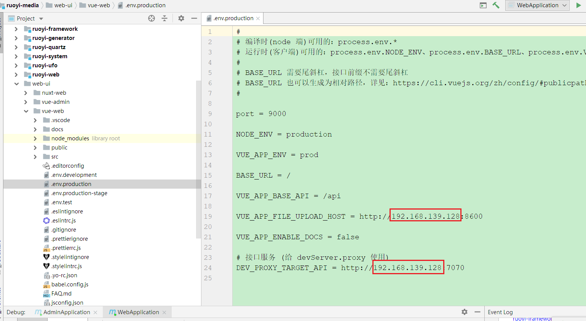
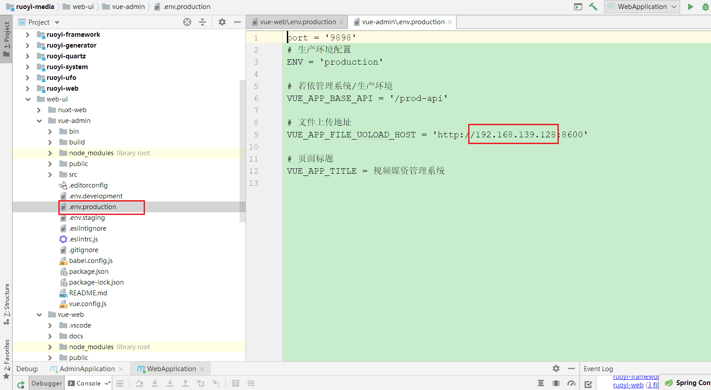

# 媒资系统部署方案

部署步骤

- 安装docker

- 安装docker-compose

- 拉取代码

- 编写脚本

- 执行测试

  

# 安装Docker

官方文档：https://docs.docker.com/engine/install

使用yum命令在线安装

```shell
#安装官方文档 https://docs.docker.com/engine/install/centos/
#卸载旧版本
sudo yum remove docker \
                  docker-client \
                  docker-client-latest \
                  docker-common \
                  docker-latest \
                  docker-latest-logrotate \
                  docker-logrotate \
                  docker-engine

#安装

sudo yum install -y yum-utils

sudo yum-config-manager \
    --add-repo \
    https://download.docker.com/linux/centos/docker-ce.repo

yum install docker

#安装后查看Docker版本
docker -v


# 设置开机自启
systemctl enable docker
# 启动docker
systemctl start docker
```


# 安装docker-compose

官方文档：https://docs.docker.com/compose/install/


## 1.1卸载

docker-compose卸载只需要删除二进制文件就可以了。

```
sudo rm /usr/local/bin/docker-compose
```

## 1.2下载

然后下载docker-compose

```shell
sudo curl -L "https://github.com/docker/compose/releases/download/1.26.2/docker-compose-$(uname -s)-$(uname -m)" -o /usr/local/bin/docker-compose
```

1.29.2版本太高所以我们安装26版本的



## 1.3授权

下载完成后，我们进入到下面的目录

```shell
cd /usr/local/bin
```

然后加入执行权限

```shell
sudo chmod +x docker-compose
```

查看是否安装成功

```shell
docker-compose version
```


## 1.4创建Docker file

```dockerfile
# 基础镜像
FROM redis
# author
MAINTAINER thh

# 挂载目录
VOLUME /home/thh/redis
# 创建目录
RUN mkdir -p /thh/thh/redis
# 指定路径
WORKDIR /home/thh/redis
# 复制conf文件到路径
COPY ./conf/redis.conf /home/thh/redis/redis.conf
```


## 1.5创建docker-compose.yml

```YML
version : '3.8'
services:
  ruoyi-mysql:
    container_name: ruoyi-mysql
    image: mysql:5.7
    restart: always
    build:
      context: ./mysql
    ports:
      - "3306:3306"
    volumes:
      - ./mysql/conf:/etc/mysql/conf.d
      - ./mysql/logs:/logs
      - ./mysql/data:/var/lib/mysql
      - ./mysql/db/:/docker-entrypoint-initdb.d/
    privileged: true
    command: [
          'mysqld',
          '--innodb-buffer-pool-size=80M',
          '--character-set-server=utf8mb4',
          '--collation-server=utf8mb4_unicode_ci',
          '--default-time-zone=+8:00',
          '--lower-case-table-names=1'
        ]
    environment:
      MYSQL_DATABASE: 'ruoyi-media'
      MYSQL_ROOT_PASSWORD: 123456
  ruoyi-redis:
    container_name: ruoyi-redis
    image: redis
    build:
      context: ./redis
    ports:
      - "6379:6379"
    volumes:
      - ./redis/conf/redis.conf:/home/ruoyi/redis/redis.conf
      - ./redis/data:/data
    command: redis-server /home/ruoyi/redis/redis.conf
    privileged: true
```


## 1.6使用Compose构建和运行应用程序

在项目目录中，通过运行启动应用程序 `docker-compose up`.

```shell
#默认启动当前目录下的docker-compose.yml文件
docker-compose up
#启动其他名字的.yml文件
docker-compose -f ../yaml/mysql.yml up -d

#默认停止当前目录下的docker-compose.yml文件
docker-compose down

#默认停止当前目录下的docker-compose.yml文件
docker-compose down

#停止其他名字的.yml文件
docker-compose -f ../yaml/mysql.yml down
```


# 安装 Node.js

## 1.安装

```bash
wget https://nodejs.org/dist/v12.18.1/node-v12.18.1-linux-x64.tar.xz    // 下载
tar xf node-v12.18.1-linux-x64.tar.xz -C /home    // 解压
cd node-v12.18.1-linux-x64                                              // 进入解压目录
```

解压文件的 bin 目录底下包含了 node、npm 等命令，我们可以修改linux系统的环境变量（profile）来设置直接运行命令：

**老规矩先备份，养成修改重要文件之前先备份的好习惯。**

```bash
cp /etc/profile /etc/profile.bak
```

然后 vim /etc/profile，在最下面添加 export PATH=$PATH: 后面跟上 node 下 bin 目录的路径

```html
export PATH=$PATH:/home/node-v12.18.1-linux-x64/bin
```

立即生效

```bash
source /etc/profile
node -v
```


## 2.npm 更换阿里云镜像

```xshe
npm config set registry https://registry.npm.taobao.org --global

npm config set disturl https://npm.taobao.org/dist --global
```

**查看本地镜像源**

```shell
#查看本地镜像源
npm config get registry  
```


# 安装git

## 1.1安装git

```bash
#安装
yum install git
#查看版本
git version
```





## 1.2拉取代码

```shell
cd /home
git clone https://gitee.com/tanhuihuang/ruoyi-media.git
```




# 安装maven

## 1.1安装

```shell

mkdir /home/maven
cd /home/maven
#下载
wget https://dlcdn.apache.org/maven/maven-3/3.8.2/binaries/apache-maven-3.8.2-bin.tar.gz


tar -zxvf /home/apache-maven-3.6.3-bin.tar.gz   -C  /home/maven
#编辑环境变量文件
vim /etc/profile

MAVEN_HOME=/home/maven/apache-maven-3.6.3
export MAVEN_HOME
export PATH=${PATH}:${MAVEN_HOME}/bin

#环境文件生效
source /etc/profile


#查看maven版本
mvn -v
```

## 1.2配置仓库

在settings.xml文件中的mirrors下添加mirror标签

```xml
<!-- 阿里云仓库 -->
    <mirror>
        <id>alimaven</id>
        <mirrorOf>central</mirrorOf>
        <name>aliyun maven</name>
        <url>http://maven.aliyun.com/nexus/content/repositories/central/</url>
    </mirror>
 
 
    <!-- 中央仓库1 -->
    <mirror>
        <id>repo1</id>
        <mirrorOf>central</mirrorOf>
        <name>Human Readable Name for this Mirror.</name>
        <url>http://repo1.maven.org/maven2/</url>
    </mirror>
 
 
    <!-- 中央仓库2 -->
    <mirror>
        <id>repo2</id>
        <mirrorOf>central</mirrorOf>
        <name>Human Readable Name for this Mirror.</name>
        <url>http://repo2.maven.org/maven2/</url>
    </mirror>
```


## 1.3设置jar包保存路径


**改后的效果**


```xml
<?xml version="1.0" encoding="UTF-8"?>
<settings xmlns="http://maven.apache.org/SETTINGS/1.0.0"
          xmlns:xsi="http://www.w3.org/2001/XMLSchema-instance"
          xsi:schemaLocation="http://maven.apache.org/SETTINGS/1.0.0 http://maven.apache.org/xsd/settings-1.0.0.xsd">
  <!-- localRepository
   | The path to the local repository maven will use to store artifacts.
   |
   | Default: ${user.home}/.m2/repository
  <localRepository>/path/to/local/repo</localRepository>
  -->

<localRepository>/home/maven/repo</localRepository>

  <!-- interactiveMode
   | This will determine whether maven prompts you when it needs input. If set to false,
   | maven will use a sensible default value, perhaps based on some other setting, for
   | the parameter in question.
   |
   | Default: true
  <interactiveMode>true</interactiveMode>
  -->

  <!-- offline
   | Determines whether maven should attempt to connect to the network when executing a build.
   | This will have an effect on artifact downloads, artifact deployment, and others.
   |
   | Default: false
  <offline>false</offline>
  -->

  <!-- pluginGroups
   | This is a list of additional group identifiers that will be searched when resolving plugins by their prefix, i.e.
   | when invoking a command line like "mvn prefix:goal". Maven will automatically add the group identifiers
   | "org.apache.maven.plugins" and "org.codehaus.mojo" if these are not already contained in the list.
   |-->
  <pluginGroups>
    <!-- pluginGroup
     | Specifies a further group identifier to use for plugin lookup.
    <pluginGroup>com.your.plugins</pluginGroup>
    -->
  </pluginGroups>

  <!-- proxies
   | This is a list of proxies which can be used on this machine to connect to the network.
   | Unless otherwise specified (by system property or command-line switch), the first proxy
   | specification in this list marked as active will be used.
   |-->
  <proxies>
    <!-- proxy
     | Specification for one proxy, to be used in connecting to the network.
     |
    <proxy>
      <id>optional</id>
      <active>true</active>
      <protocol>http</protocol>
      <username>proxyuser</username>
      <password>proxypass</password>
      <host>proxy.host.net</host>
      <port>80</port>
      <nonProxyHosts>local.net|some.host.com</nonProxyHosts>
    </proxy>
    -->
  </proxies>

  <!-- servers
   | This is a list of authentication profiles, keyed by the server-id used within the system.
   | Authentication profiles can be used whenever maven must make a connection to a remote server.
   |-->
  <servers>
    <!-- server
     | Specifies the authentication information to use when connecting to a particular server, identified by
     | a unique name within the system (referred to by the 'id' attribute below).
     |
     | NOTE: You should either specify username/password OR privateKey/passphrase, since these pairings are
     |       used together.
     |
    <server>
      <id>deploymentRepo</id>
      <username>repouser</username>
      <password>repopwd</password>
    </server>
    -->

    <!-- Another sample, using keys to authenticate.
    <server>
      <id>siteServer</id>
      <privateKey>/path/to/private/key</privateKey>
      <passphrase>optional; leave empty if not used.</passphrase>
    </server>
    -->
  </servers>

  <mirrors>
    <!-- 阿里云仓库 -->
    <mirror>
        <id>alimaven</id>
        <mirrorOf>central</mirrorOf>
        <name>aliyun maven</name>
        <url>http://maven.aliyun.com/nexus/content/repositories/central/</url>
    </mirror>
 
 
    <!-- 中央仓库1 -->
    <mirror>
        <id>repo1</id>
        <mirrorOf>central</mirrorOf>
        <name>Human Readable Name for this Mirror.</name>
        <url>http://repo1.maven.org/maven2/</url>
    </mirror>
 
 
    <!-- 中央仓库2 -->
    <mirror>
        <id>repo2</id>
        <mirrorOf>central</mirrorOf>
        <name>Human Readable Name for this Mirror.</name>
        <url>http://repo2.maven.org/maven2/</url>
    </mirror>
  </mirrors>

  <profiles>
  </profiles>
</settings>

```


# 修改配置文件






# 编写脚本

## 梳理步骤

拉取代码 -》 maven打包后端 -》npm打包前端 -》移动打包的文件到对应的dockerfile目录 -》docker-compose启动

### 1.1拉取代码

```bash
cd /home
git clone https://gitee.com/tanhuihuang/ruoyi-media.git
```


### 1.2maven打包后端

```bash
#进入目录
cd /home/ruoyi-media
#打包
echo 'mvn打包ruoyi-media'
mvn clean package -Dmaven.test.skip=true
echo 'cp ruoyi-admin到dockerfile目录'
cp /home/ruoyi-media/ruoyi-admin/target/ruoyi-admin.jar  /home/ruoyi-media/docker/ruoyi/admin/jar

echo 'cp ruoyi-web到dockerfile目录'
cp /home/ruoyi-media/ruoyi-web/target/ruoyi-web.jar  /home/ruoyi-media/docker/ruoyi/web/jar
```


### 1.3 node打包前端

```bash
#打包vue-admin
cd /home/ruoyi-media/web-ui/vue-admin
#下载依赖
npm install --registry=https://registry.npm.taobao.org
#打包
npm run build:prod
#复制
cp /home/ruoyi-media/web-ui/vue-admin/dist -r /home/ruoyi-media/docker/nginx/html/admin

#打包vue-web
cd /home/ruoyi-media/web-ui/vue-web
#下载依赖
npm install --registry=https://registry.npm.taobao.org
#打包
npm run build:prod

#复制
cp /home/ruoyi-media/web-ui/vue-web/dist -r /home/ruoyi-media/docker/nginx/html/web

```


### 1.4启动docker-compose

```bash
#创建thh network
docker network create thh
cd /home/ruoyi-media/docker
#停止
docker-compose down
#启动
docker-compose up
```


# 整合脚本

对应docker文件夹下的start.sh

```bash
#!/bin/sh

#停止
docker-compose down

docker rmi docker_ruoyi-web

docker rmi docker_ruoyi-admin

docker rmi nginx

#进入目录
cd /home/ruoyi-media
#打包
echo 'mvn打包ruoyi-media'
mvn clean package -Dmaven.test.skip=true
echo 'cp ruoyi-admin到dockerfile目录'
cp /home/ruoyi-media/ruoyi-admin/target/ruoyi-admin.jar  /home/ruoyi-media/docker/ruoyi/admin/jar

echo 'cp ruoyi-web到dockerfile目录'
cp /home/ruoyi-media/ruoyi-web/target/ruoyi-web.jar  /home/ruoyi-media/docker/ruoyi/web/jar

#打包vue-admin
cd /home/ruoyi-media/web-ui/vue-admin
#下载依赖
npm install --registry=https://registry.npm.taobao.org
#打包
npm run build:prod
#复制
cp /home/ruoyi-media/web-ui/vue-admin/dist -r /home/ruoyi-media/docker/nginx/html/admin

#打包vue-web
cd /home/ruoyi-media/web-ui/vue-web
#下载依赖
npm install --registry=https://registry.npm.taobao.org
#打包
npm run build:prod

#复制
cp /home/ruoyi-media/web-ui/vue-web/dist -r /home/ruoyi-media/docker/nginx/html/web

cd /home/ruoyi-media/docker


#启动
docker-compose up
```


